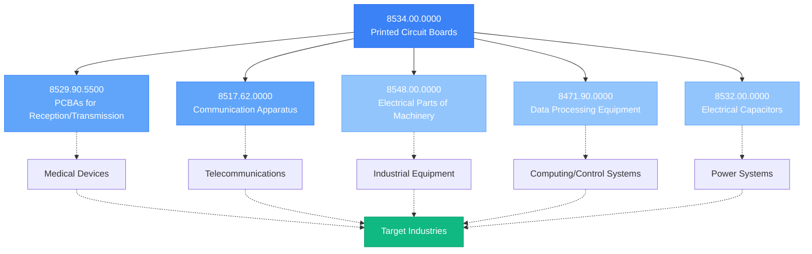
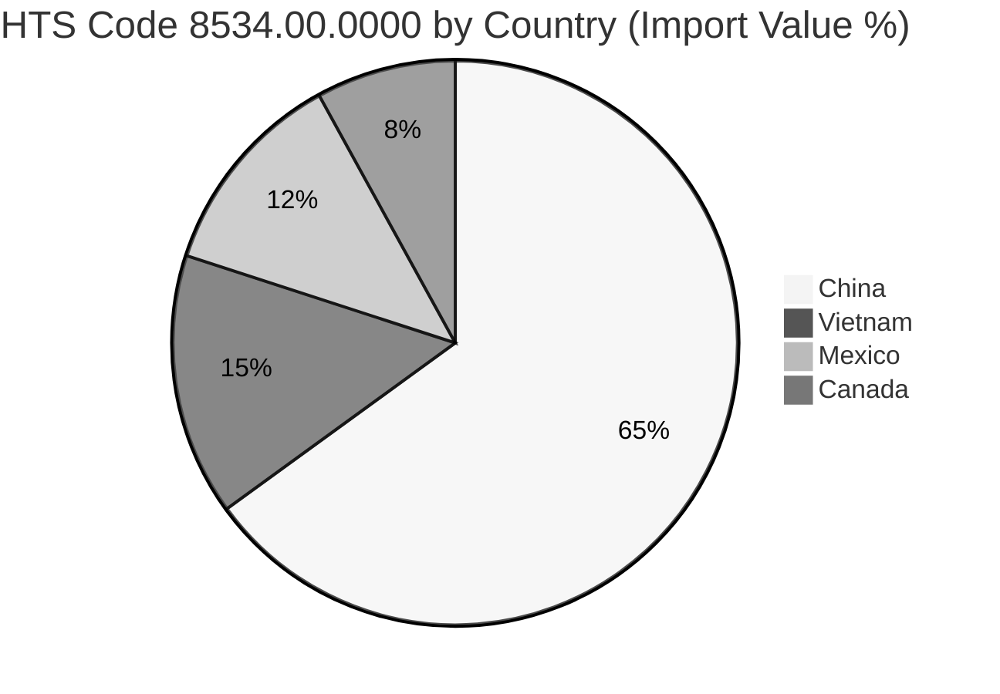

# 🔍 HTS Code Analysis for PCBA Suppliers

<h3 style="margin-top: 0; color: #1E3A8A;">Analysis Overview</h3>

This document provides a detailed analysis of the Harmonized Tariff Schedule (HTS) codes used to identify and classify PCBA suppliers in our target markets. Understanding these codes is crucial for accurate data collection and filtering of potential suppliers.

## 📋 Primary HTS Codes Summary

<table style="width: 100%; border-collapse: collapse; border-radius: 8px; overflow: hidden;">
  <thead>
    <tr style="background-color: #2563EB; color: white;">
      <th style="padding: 12px 15px; text-align: left;">HTS Code</th>
      <th style="padding: 12px 15px; text-align: left;">Description</th>
      <th style="padding: 12px 15px; text-align: center;">Relevance</th>
      <th style="padding: 12px 15px; text-align: center;">Accuracy</th>
      <th style="padding: 12px 15px; text-align: center;">Usage</th>
    </tr>
  </thead>
  <tbody>
    <tr style="background-color: #F9FAFB;">
      <td style="padding: 12px 15px; font-weight: bold;"><code>8534.00.0000</code></td>
      <td style="padding: 12px 15px;">Printed circuit boards</td>
      <td style="padding: 12px 15px; text-align: center;">
        

          

        

        
90%

      </td>
      <td style="padding: 12px 15px; text-align: center;">
        

          

        

        
70%

      </td>
      <td style="padding: 12px 15px; text-align: center;">Primary</td>
    </tr>
    <tr style="background-color: #F3F4F6;">
      <td style="padding: 12px 15px; font-weight: bold;"><code>8529.90.5500</code></td>
      <td style="padding: 12px 15px;">PCBAs for reception/transmission equipment</td>
      <td style="padding: 12px 15px; text-align: center;">
        

          

        

        
85%

      </td>
      <td style="padding: 12px 15px; text-align: center;">
        

          

        

        
85%

      </td>
      <td style="padding: 12px 15px; text-align: center;">Secondary</td>
    </tr>
    <tr style="background-color: #F9FAFB;">
      <td style="padding: 12px 15px; font-weight: bold;"><code>8517.62.0000</code></td>
      <td style="padding: 12px 15px;">Communication apparatus PCBAs</td>
      <td style="padding: 12px 15px; text-align: center;">
        

          

        

        
75%

      </td>
      <td style="padding: 12px 15px; text-align: center;">
        

          

        

        
80%

      </td>
      <td style="padding: 12px 15px; text-align: center;">Secondary</td>
    </tr>
    <tr style="background-color: #F3F4F6;">
      <td style="padding: 12px 15px; font-weight: bold;"><code>8548.00.0000</code></td>
      <td style="padding: 12px 15px;">Electrical parts of machinery</td>
      <td style="padding: 12px 15px; text-align: center;">
        

          

        

        
60%

      </td>
      <td style="padding: 12px 15px; text-align: center;">
        

          

        

        
50%

      </td>
      <td style="padding: 12px 15px; text-align: center;">Tertiary</td>
    </tr>
    <tr style="background-color: #F9FAFB;">
      <td style="padding: 12px 15px; font-weight: bold;"><code>8471.90.0000</code></td>
      <td style="padding: 12px 15px;">Data processing equipment PCBAs</td>
      <td style="padding: 12px 15px; text-align: center;">
        

          

        

        
65%

      </td>
      <td style="padding: 12px 15px; text-align: center;">
        

          

        

        
60%

      </td>
      <td style="padding: 12px 15px; text-align: center;">Tertiary</td>
    </tr>
  </tbody>
</table>

## 🔄 HTS Code Interrelationships

## 📊 HTS Code Usage Patterns

The following chart shows the percentage of companies using each HTS code in our filtered dataset:

  

    8534.00.0000
    

      

        

      

    

    100%
  

  
  

    8532.00.0000
    

      

        

      

    

    40%
  

  
  

    8529.90.5500
    

      

        

      

    

    27%
  

  
  

    8517.62.0000
    

      

        

      

    

    27%
  

  
  

    8548.00.0000
    

      

        

      

    

    27%
  

  
  

    8471.90.0000
    

      

        

      

    

    20%
  

## 🧩 HTS Subcategories for 8534.00.0000

  

    <h4 style="margin-top: 0; color: #1E40AF;">8534.00.00.20</h4>
    
PCBs with 3+ layers of conducting materials

    

      <strong>Relevance:</strong> High 
      <strong>Industries:</strong> Medical, Aerospace
    

  

  
  

    <h4 style="margin-top: 0; color: #1E40AF;">8534.00.00.40</h4>
    
Other standard PCBs

    

      <strong>Relevance:</strong> Medium 
      <strong>Industries:</strong> Various
    

  

  
  

    <h4 style="margin-top: 0; color: #1E40AF;">8534.00.00.50</h4>
    
PCBs with impregnated paper base

    

      <strong>Relevance:</strong> Low 
      <strong>Industries:</strong> Legacy applications
    

  

  
  

    <h4 style="margin-top: 0; color: #1E40AF;">8534.00.00.70</h4>
    
Other not specified PCBs

    

      <strong>Relevance:</strong> Medium 
      <strong>Industries:</strong> Various
    

  

  
  

    <h4 style="margin-top: 0; color: #1E40AF;">8534.00.00.80</h4>
    
Flexible PCBs

    

      <strong>Relevance:</strong> High 
      <strong>Industries:</strong> Medical, Green Energy
    

  

  
  

    <h4 style="margin-top: 0; color: #1E40AF;">8534.00.00.85</h4>
    
PCBs with ceramic base

    

      <strong>Relevance:</strong> High 
      <strong>Industries:</strong> Oil & Gas, Aerospace
    

  

  
  

    <h4 style="margin-top: 0; color: #1E40AF;">8534.00.00.95</h4>
    
Other PCBs

    

      <strong>Relevance:</strong> Medium 
      <strong>Industries:</strong> Various
    

  

## 📈 HTS Code Performance Analysis

<table style="width: 100%; border-collapse: collapse;">
  <thead>
    <tr style="background-color: #2563EB; color: white;">
      <th style="padding: 12px 15px; text-align: left;">Metrics</th>
      <th style="padding: 12px 15px; text-align: center;">8534.00</th>
      <th style="padding: 12px 15px; text-align: center;">8529.90</th>
      <th style="padding: 12px 15px; text-align: center;">8517.62</th>
      <th style="padding: 12px 15px; text-align: center;">8548.00</th>
      <th style="padding: 12px 15px; text-align: center;">8471.90</th>
    </tr>
  </thead>
  <tbody>
    <tr style="background-color: #F9FAFB;">
      <td style="padding: 12px 15px; font-weight: bold;">Total Results</td>
      <td style="padding: 12px 15px; text-align: center;">3,139</td>
      <td style="padding: 12px 15px; text-align: center;">1,862</td>
      <td style="padding: 12px 15px; text-align: center;">2,403</td>
      <td style="padding: 12px 15px; text-align: center;">1,250</td>
      <td style="padding: 12px 15px; text-align: center;">975</td>
    </tr>
    <tr style="background-color: #F3F4F6;">
      <td style="padding: 12px 15px; font-weight: bold;">Results in Range</td>
      <td style="padding: 12px 15px; text-align: center;">325</td>
      <td style="padding: 12px 15px; text-align: center;">178</td>
      <td style="padding: 12px 15px; text-align: center;">203</td>
      <td style="padding: 12px 15px; text-align: center;">98</td>
      <td style="padding: 12px 15px; text-align: center;">76</td>
    </tr>
    <tr style="background-color: #F9FAFB;">
      <td style="padding: 12px 15px; font-weight: bold;">Industry Match %</td>
      <td style="padding: 12px 15px; text-align: center;">42%</td>
      <td style="padding: 12px 15px; text-align: center;">35%</td>
      <td style="padding: 12px 15px; text-align: center;">29%</td>
      <td style="padding: 12px 15px; text-align: center;">25%</td>
      <td style="padding: 12px 15px; text-align: center;">28%</td>
    </tr>
    <tr style="background-color: #F3F4F6;">
      <td style="padding: 12px 15px; font-weight: bold;">PCBA vs PCB Ratio</td>
      <td style="padding: 12px 15px; text-align: center;">60/40</td>
      <td style="padding: 12px 15px; text-align: center;">85/15</td>
      <td style="padding: 12px 15px; text-align: center;">75/25</td>
      <td style="padding: 12px 15px; text-align: center;">65/35</td>
      <td style="padding: 12px 15px; text-align: center;">70/30</td>
    </tr>
    <tr style="background-color: #F9FAFB;">
      <td style="padding: 12px 15px; font-weight: bold;">False Positive Rate</td>
      <td style="padding: 12px 15px; text-align: center;">30%</td>
      <td style="padding: 12px 15px; text-align: center;">15%</td>
      <td style="padding: 12px 15px; text-align: center;">20%</td>
      <td style="padding: 12px 15px; text-align: center;">50%</td>
      <td style="padding: 12px 15px; text-align: center;">40%</td>
    </tr>
  </tbody>
</table>

## 🧪 Code Validation Methodology

  
1

  

    <h4 style="margin-top: 0; margin-bottom: 4px; color: #1E40AF;">Initial HTS Code Search</h4>
    
Search all primary HTS codes across target import databases.

  

  
  
2

  

    <h4 style="margin-top: 0; margin-bottom: 4px; color: #1E40AF;">Apply Volume Filters</h4>
    
Filter results to companies with $1M-$10M annual import volume.

  

  
  
3

  

    <h4 style="margin-top: 0; margin-bottom: 4px; color: #1E40AF;">Website & Product Validation</h4>
    
Review company websites to confirm they're PCBA assemblers, not just PCB manufacturers.

  

  
  
4

  

    <h4 style="margin-top: 0; margin-bottom: 4px; color: #1E40AF;">Import Declaration Review</h4>
    
Sample import declarations to verify product descriptions match PCBA classification.

  

  
  
5

  

    <h4 style="margin-top: 0; margin-bottom: 4px; color: #1E40AF;">Industry Classification</h4>
    
Match companies to target industries through NAICS codes and website content analysis.

  

  
  
6

  

    <h4 style="margin-top: 0; margin-bottom: 4px; color: #1E40AF;">Final Validation</h4>
    
Cross-reference findings across multiple data sources to confirm accuracy.

  

## 🌐 Geographic Analysis of HTS Code Usage

  

    <h4 style="margin-top: 0; color: #0F172A;">China HTS Specifics</h4>
    <ul style="padding-left: 20px; margin-bottom: 0;">
      <li>Primary code: 8534.00.0000</li>
      <li>Secondary codes: 8517.62, 8532.00</li>
      <li>Unique codes: 9013.80 (optical PCBAs)</li>
      <li>Duty rate: 0%</li>
    </ul>
  

  
  

    <h4 style="margin-top: 0; color: #0F172A;">Vietnam HTS Specifics</h4>
    <ul style="padding-left: 20px; margin-bottom: 0;">
      <li>Primary code: 8534.00.0000</li>
      <li>Secondary codes: 8548.00, 8517.62</li>
      <li>Unique codes: None significant</li>
      <li>Duty rate: 0%</li>
    </ul>
  

  
  

    <h4 style="margin-top: 0; color: #0F172A;">Mexico HTS Specifics</h4>
    <ul style="padding-left: 20px; margin-bottom: 0;">
      <li>Primary code: 8534.00.0000</li>
      <li>Secondary codes: 8529.90, 8471.90</li>
      <li>Unique codes: None significant</li>
      <li>Duty rate: 0% (USMCA)</li>
    </ul>
  

  
  

    <h4 style="margin-top: 0; color: #0F172A;">Canada HTS Specifics</h4>
    <ul style="padding-left: 20px; margin-bottom: 0;">
      <li>Primary code: 8534.00.0000</li>
      <li>Secondary codes: 8529.90, 8471.90</li>
      <li>Unique codes: None significant</li>
      <li>Duty rate: 0% (USMCA)</li>
    </ul>
  

## 📝 Key Findings & Recommendations

  <h3 style="margin-top: 0; color: #0F172A;">Key Findings</h3>
  
  

    <h4 style="margin-bottom: 8px; color: #334155;">1. Code Accuracy</h4>
    
HTS code 8534.00.0000 provides the broadest coverage but also has the highest false-positive rate (30%). Supplementary codes provide better accuracy but narrower industry focus.

  

  
  

    <h4 style="margin-bottom: 8px; color: #334155;">2. PCB vs PCBA Differentiation</h4>
    
All HTS codes contain a mix of bare PCB and assembled PCBA products. The 8529.90.5500 code has the highest PCBA ratio (85%), making it the most reliable for identifying true PCBA suppliers.

  

  
  

    <h4 style="margin-bottom: 8px; color: #334155;">3. Industry Correlation</h4>
    
The 8534.00.0000 code has the highest correlation to our target industries (42%), followed by 8529.90.5500 (35%). Industry-specific sub-codes are particularly relevant for medical and aerospace applications.

  

  <h3 style="margin-top: 0; color: #1E40AF;">Recommendations</h3>
  <ol style="padding-left: 20px; margin-bottom: 0;">
    <li style="margin-bottom: 8px;"><strong>Primary Search:</strong> Use 8534.00.0000 as the base code for comprehensive coverage.</li>
    <li style="margin-bottom: 8px;"><strong>Secondary Validation:</strong> Cross-reference with 8529.90.5500 and 8517.62.0000 for higher PCBA accuracy.</li>
    <li style="margin-bottom: 8px;"><strong>Industry Filtering:</strong> Use 8534.00.00.20 (multi-layer) and 8534.00.00.85 (ceramic base) for targeting medical and aerospace applications.</li>
    <li style="margin-bottom: 8px;"><strong>Manual Verification:</strong> Implement website and product description review to eliminate false positives.</li>
    <li style="margin-bottom: 0;"><strong>Geographic Focus:</strong> Prioritize China and Vietnam for broader search, Mexico and Canada for higher industry specificity.</li>
  </ol>

---

HTS Code Analysis Prepared by Data Intelligence Team 
Last Updated: April 12, 2023

