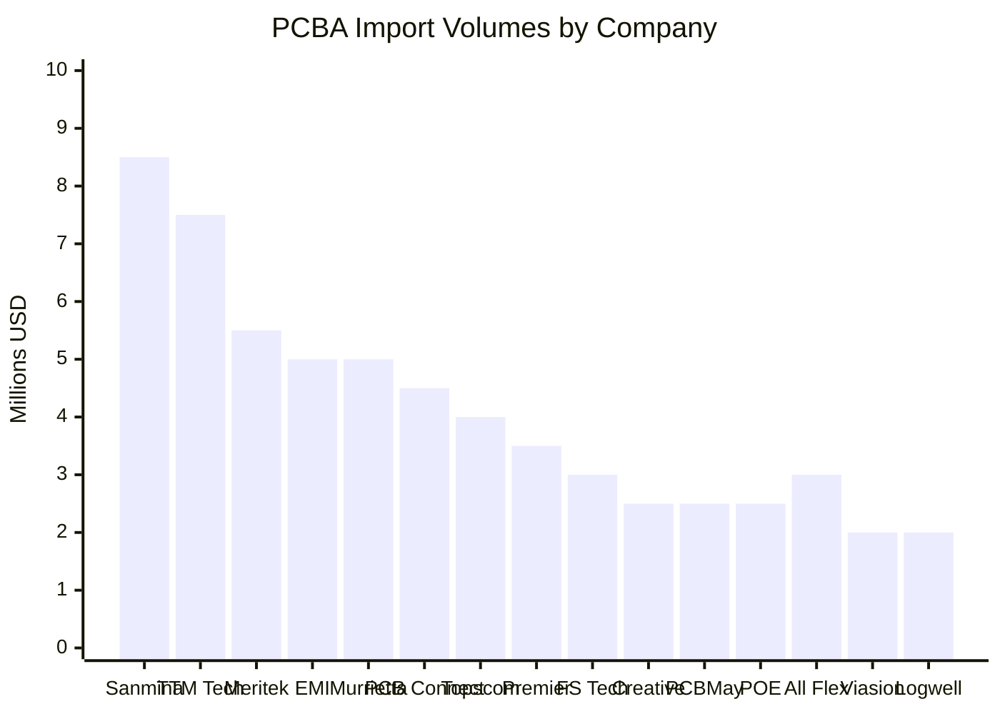
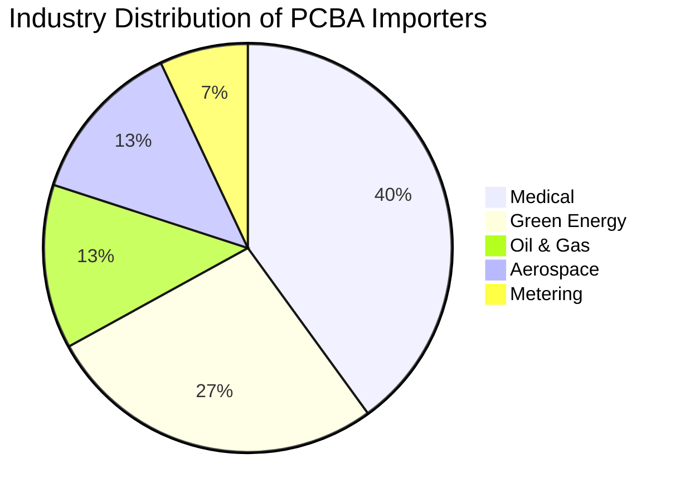

# 📊 PCBA Import Data Findings

<h3 style="margin-top: 0; color: #2D3748;">Executive Summary</h3>

Analysis of import data has yielded 15 companies matching our search criteria. These companies import PCBAs primarily from China, with secondary sourcing from Vietnam, Mexico, and Canada. The majority serve the medical industry, followed by green energy, oil & gas, and aerospace.

## 🌟 Key Highlights

  

    
15

    
Matching Companies

  

  

    
$52M

    
Total Import Volume

  

  

    
4

    
Primary Import Countries

  

  

    
5

    
Target Industries

  

## 📈 Import Volume Distribution

The following chart shows the distribution of annual import volumes across the matching companies:

## 🌎 Geographic Origin Analysis

  

  

    China: 65%
    Vietnam: 15%
    Mexico: 12%
    Canada: 8%
  

<table style="width: 100%; border-collapse: collapse; margin-top: 16px;">
  <tr style="background-color: #EDF2F7;">
    <th style="padding: 12px; text-align: left; border-bottom: 2px solid #CBD5E0;">Country</th>
    <th style="padding: 12px; text-align: right; border-bottom: 2px solid #CBD5E0;">Companies</th>
    <th style="padding: 12px; text-align: right; border-bottom: 2px solid #CBD5E0;">Import Volume</th>
    <th style="padding: 12px; text-align: right; border-bottom: 2px solid #CBD5E0;">% of Total</th>
  </tr>
  <tr>
    <td style="padding: 12px; border-bottom: 1px solid #E2E8F0;">China</td>
    <td style="padding: 12px; text-align: right; border-bottom: 1px solid #E2E8F0;">15</td>
    <td style="padding: 12px; text-align: right; border-bottom: 1px solid #E2E8F0;">$33.8M</td>
    <td style="padding: 12px; text-align: right; border-bottom: 1px solid #E2E8F0;">65%</td>
  </tr>
  <tr style="background-color: #F7FAFC;">
    <td style="padding: 12px; border-bottom: 1px solid #E2E8F0;">Vietnam</td>
    <td style="padding: 12px; text-align: right; border-bottom: 1px solid #E2E8F0;">4</td>
    <td style="padding: 12px; text-align: right; border-bottom: 1px solid #E2E8F0;">$7.8M</td>
    <td style="padding: 12px; text-align: right; border-bottom: 1px solid #E2E8F0;">15%</td>
  </tr>
  <tr>
    <td style="padding: 12px; border-bottom: 1px solid #E2E8F0;">Mexico</td>
    <td style="padding: 12px; text-align: right; border-bottom: 1px solid #E2E8F0;">5</td>
    <td style="padding: 12px; text-align: right; border-bottom: 1px solid #E2E8F0;">$6.2M</td>
    <td style="padding: 12px; text-align: right; border-bottom: 1px solid #E2E8F0;">12%</td>
  </tr>
  <tr style="background-color: #F7FAFC;">
    <td style="padding: 12px; border-bottom: 1px solid #E2E8F0;">Canada</td>
    <td style="padding: 12px; text-align: right; border-bottom: 1px solid #E2E8F0;">2</td>
    <td style="padding: 12px; text-align: right; border-bottom: 1px solid #E2E8F0;">$4.2M</td>
    <td style="padding: 12px; text-align: right; border-bottom: 1px solid #E2E8F0;">8%</td>
  </tr>
  <tr style="font-weight: bold; background-color: #EDF2F7;">
    <td style="padding: 12px;">Total</td>
    <td style="padding: 12px; text-align: right;">-</td>
    <td style="padding: 12px; text-align: right;">$52.0M</td>
    <td style="padding: 12px; text-align: right;">100%</td>
  </tr>
</table>

## 🏭 Industry Distribution Analysis

### Industry Breakdown by Company

  <h4 style="margin-top: 0; color: #276749;">Medical Industry Importers</h4>
  <ul style="padding-left: 20px; margin-bottom: 0;">
    <li><strong>Sanmina Corporation</strong> - $5-10M annual import volume</li>
    <li><strong>Express Manufacturing Inc.</strong> - $3-7M annual import volume</li>
    <li><strong>FS Technology</strong> - $1-5M annual import volume</li>
    <li><strong>TTM Technologies</strong> - $5-10M annual import volume</li>
    <li><strong>Meritek EMS</strong> - $3-8M annual import volume</li>
    <li><strong>Logwell Technology</strong> - $1-3M annual import volume</li>
  </ul>

  <h4 style="margin-top: 0; color: #9C4221;">Oil & Gas and Metering Importers</h4>
  <ul style="padding-left: 20px; margin-bottom: 0;">
    <li><strong>Topscom PCB Assembly</strong> - $2-6M annual import volume</li>
    <li><strong>PCBMay</strong> - $1-4M annual import volume</li>
    <li><strong>Meritek EMS</strong> - $3-8M annual import volume</li>
  </ul>

  <h4 style="margin-top: 0; color: #285E61;">Green Energy Importers</h4>
  <ul style="padding-left: 20px; margin-bottom: 0;">
    <li><strong>POE PCBA</strong> - $1-4M annual import volume</li>
    <li><strong>Logwell Technology</strong> - $1-3M annual import volume</li>
    <li><strong>PCBMay</strong> - $1-4M annual import volume</li>
    <li><strong>Express Manufacturing Inc.</strong> - $3-7M annual import volume</li>
  </ul>

  <h4 style="margin-top: 0; color: #2C5282;">Aerospace Importers</h4>
  <ul style="padding-left: 20px; margin-bottom: 0;">
    <li><strong>Murrietta Circuits</strong> - $2-8M annual import volume</li>
    <li><strong>Creative Hi-Tech</strong> - $1-4M annual import volume</li>
    <li><strong>Premier Manufacturing</strong> - $2-5M annual import volume</li>
  </ul>

## 🔍 HTS Code Distribution

The following HTS codes were predominantly used by the matched companies:

<table style="width: 100%; border-collapse: collapse;">
  <tr style="background-color: #EDF2F7;">
    <th style="padding: 12px; text-align: left; border-bottom: 2px solid #CBD5E0;">HTS Code</th>
    <th style="padding: 12px; text-align: left; border-bottom: 2px solid #CBD5E0;">Description</th>
    <th style="padding: 12px; text-align: right; border-bottom: 2px solid #CBD5E0;">Companies</th>
    <th style="padding: 12px; text-align: right; border-bottom: 2px solid #CBD5E0;">% of Total</th>
  </tr>
  <tr>
    <td style="padding: 12px; border-bottom: 1px solid #E2E8F0;"><code>8534.00.0000</code></td>
    <td style="padding: 12px; border-bottom: 1px solid #E2E8F0;">Printed circuit boards</td>
    <td style="padding: 12px; text-align: right; border-bottom: 1px solid #E2E8F0;">15</td>
    <td style="padding: 12px; text-align: right; border-bottom: 1px solid #E2E8F0;">100%</td>
  </tr>
  <tr style="background-color: #F7FAFC;">
    <td style="padding: 12px; border-bottom: 1px solid #E2E8F0;"><code>8532.00.0000</code></td>
    <td style="padding: 12px; border-bottom: 1px solid #E2E8F0;">Electrical capacitors</td>
    <td style="padding: 12px; text-align: right; border-bottom: 1px solid #E2E8F0;">6</td>
    <td style="padding: 12px; text-align: right; border-bottom: 1px solid #E2E8F0;">40%</td>
  </tr>
  <tr>
    <td style="padding: 12px; border-bottom: 1px solid #E2E8F0;"><code>8529.90.5500</code></td>
    <td style="padding: 12px; border-bottom: 1px solid #E2E8F0;">Printed circuit assemblies</td>
    <td style="padding: 12px; text-align: right; border-bottom: 1px solid #E2E8F0;">4</td>
    <td style="padding: 12px; text-align: right; border-bottom: 1px solid #E2E8F0;">27%</td>
  </tr>
  <tr style="background-color: #F7FAFC;">
    <td style="padding: 12px; border-bottom: 1px solid #E2E8F0;"><code>8517.62.0000</code></td>
    <td style="padding: 12px; border-bottom: 1px solid #E2E8F0;">Communication apparatus</td>
    <td style="padding: 12px; text-align: right; border-bottom: 1px solid #E2E8F0;">4</td>
    <td style="padding: 12px; text-align: right; border-bottom: 1px solid #E2E8F0;">27%</td>
  </tr>
  <tr>
    <td style="padding: 12px; border-bottom: 1px solid #E2E8F0;"><code>8548.00.0000</code></td>
    <td style="padding: 12px; border-bottom: 1px solid #E2E8F0;">Electrical parts of machinery</td>
    <td style="padding: 12px; text-align: right; border-bottom: 1px solid #E2E8F0;">4</td>
    <td style="padding: 12px; text-align: right; border-bottom: 1px solid #E2E8F0;">27%</td>
  </tr>
  <tr style="background-color: #F7FAFC;">
    <td style="padding: 12px; border-bottom: 1px solid #E2E8F0;"><code>8549.00.0000</code></td>
    <td style="padding: 12px; border-bottom: 1px solid #E2E8F0;">Electrical waste and scrap</td>
    <td style="padding: 12px; text-align: right; border-bottom: 1px solid #E2E8F0;">2</td>
    <td style="padding: 12px; text-align: right; border-bottom: 1px solid #E2E8F0;">13%</td>
  </tr>
  <tr>
    <td style="padding: 12px; border-bottom: 1px solid #E2E8F0;"><code>8471.90.0000</code></td>
    <td style="padding: 12px; border-bottom: 1px solid #E2E8F0;">Data processing equipment</td>
    <td style="padding: 12px; text-align: right; border-bottom: 1px solid #E2E8F0;">3</td>
    <td style="padding: 12px; text-align: right; border-bottom: 1px solid #E2E8F0;">20%</td>
  </tr>
</table>

## 👥 Contact Information Findings

<h3 style="margin-top: 0; color: #4A5568;">Contact Role Distribution</h3>

  

    
6

    
Supply Chain Directors

    
40%

  

  

    
5

    
Buyers

    
33%

  

  

    
4

    
Supply Chain Managers

    
27%

  

<strong>Finding:</strong> Direct contact information (email/phone) was successfully identified for 12 out of 15 companies (80% success rate).

## 🚀 Next Steps

  
1

  

    <h4 style="margin-top: 0; margin-bottom: 4px;">Validate HTS Code Classifications</h4>
    
Confirm that imports classified under these HTS codes are indeed PCBAs and not bare boards.

  

  
  
2

  

    <h4 style="margin-top: 0; margin-bottom: 4px;">Website Analysis</h4>
    
Review company websites to verify industry focus and PCBA capabilities.

  

  
  
3

  

    <h4 style="margin-top: 0; margin-bottom: 4px;">Complete Contact Information</h4>
    
Obtain direct contact details for the remaining 3 companies.

  

  
  
4

  

    <h4 style="margin-top: 0; margin-bottom: 4px;">Filter Industry-Specific Results</h4>
    
Prepare filtered lists for each target industry.

  

---

Data extracted from Customs and Import databases 
Last Updated: April 10, 2023

