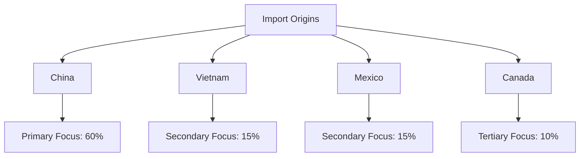

# 🔍 PCBA Search Parameters

<strong>Project Overview:</strong> This document outlines the search parameters used to identify potential PCBA (Printed Circuit Board Assembly) suppliers matching our specific requirements.

## 📋 Search Criteria Summary

| Parameter | Value | Importance |
|:----------|:------|:-----------|
| **Import Origin** | China, Vietnam, Mexico, Canada | Critical ⭐⭐⭐ |
| **Product Type** | PCBA (not bare PCB) | Critical ⭐⭐⭐ |
| **Annual Import Volume** | $1M - $10M | High ⭐⭐ |
| **HTS/Product Codes** | 8534.XX.XXXX, 8529.90.5500, etc. | High ⭐⭐ |
| **Target Industries** | Medical, Oil & Gas, Green Energy, Aerospace | Medium ⭐ |
| **Excluded Industries** | Automotive, Lighting | Medium ⭐ |
| **Ideal Contact Role** | Buyer, Supply Chain Manager/Director | Low ⭐ |

## 🌍 Geographic Focus

### Rationale for Geographic Selection

- **China**: Largest global producer of PCBAs with competitive pricing
- **Vietnam**: Emerging market with lower labor costs and increasing technical capabilities
- **Mexico**: Proximity advantages for North American distribution
- **Canada**: Strong quality control and regulatory compliance for medical devices

## 🔢 HTS Code Breakdown

The following Harmonized Tariff Schedule (HTS) codes are included in our search parameters:

<strong>8534.00.0000</strong> 
Printed circuit boards 
<em>Primary focus - Core PCBA products</em>

<strong>8529.90.5500</strong> 
Printed circuit assemblies 
<em>For reception/transmission equipment</em>

<strong>8549.XX.XXXX</strong> 
Electrical waste and scrap 
<em>May include PCBA components</em>

<strong>8548.XX.XXXX</strong> 
Electrical parts of machinery 
<em>May include complex PCBAs</em>

<strong>8517.62.XXXX</strong> 
Communication apparatus 
<em>Includes network equipment PCBAs</em>

<strong>8532.XX.XXXX</strong> 
Electrical capacitors 
<em>Component manufacturers & assemblers</em>

<strong>8471.90.XXXX</strong> 
Data processing equipment 
<em>Computing and processing PCBAs</em>

## 🎯 Target Industries

We are specifically targeting companies that serve the following industries:

Medical

Oil & Gas

Metering

Green Energy

Aerospace

### 🚫 Exclusions

We are **excluding** companies primarily focused on:

- 🚗 **Automotive** - Different certification requirements and production volumes
- 💡 **Lighting** - Simpler PCBAs with different technical requirements

## 💵 Import Volume Parameters

We are targeting companies with annual import volumes between **$1 million and $10 million** for the following reasons:

1

Small enough to be responsive to new partnership opportunities

2

Large enough to have established quality control processes

3

Appropriate scale for our production needs (500-5,000 units per order)

4

Less likely to be exclusive to major manufacturers

## 👥 Contact Role Targeting

For optimal engagement, we prioritize reaching the following roles:

1. **Buyer** - Direct purchasing authority
2. **Supply Chain Manager/Director** - Strategic sourcing authority
3. **Procurement Manager** - Operational purchasing authority

## 📊 Expected Match Distribution

Based on our criteria, we expect the following distribution of matching companies:

Medical (40%)
Green Energy (25%)
Oil & Gas (20%)
Aerospace (15%)

## ⏱️ Search Methodology Timeline

| Phase | Description | Timeframe |
|:------|:------------|:----------|
| **1. Initial Data Collection** | Gather import data from customs databases | Week 1 |
| **2. Preliminary Filtering** | Apply HTS codes and geographic filters | Week 1-2 |
| **3. Industry Analysis** | Apply industry focus filters | Week 2 |
| **4. Import Volume Verification** | Verify annual import volumes | Week 2-3 |
| **5. Data Validation** | Cross-reference with secondary sources | Week 3 |
| **6. Contact Research** | Identify appropriate contacts | Week 3-4 |
| **7. Final Report Preparation** | Compile verified data into final format | Week 4 |

---

Generated by AI-Powered Search Parameter System 
Last Updated: April 8, 2023

